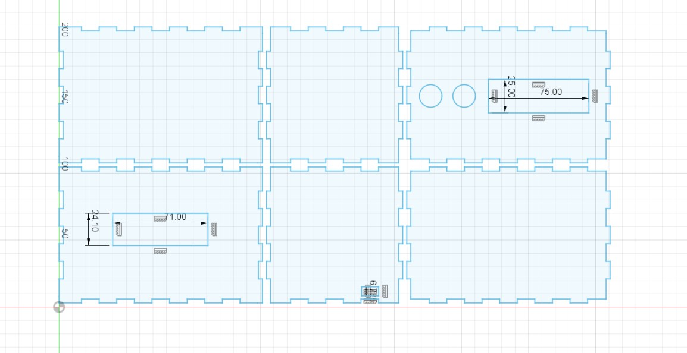
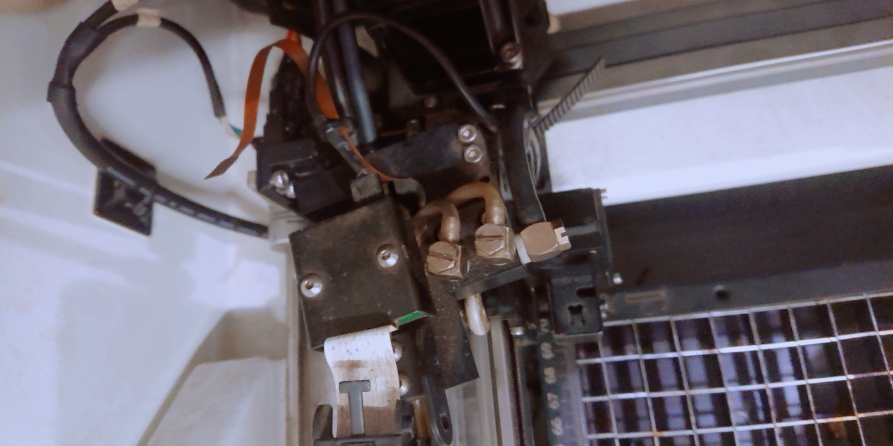
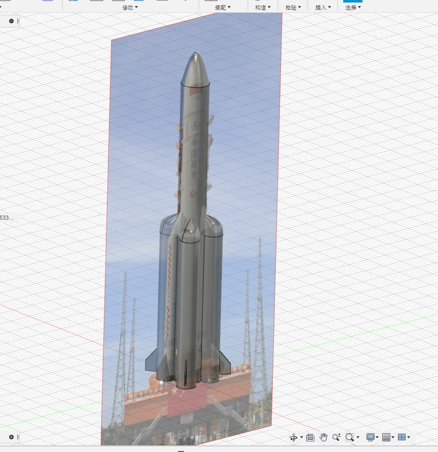
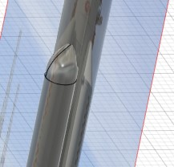
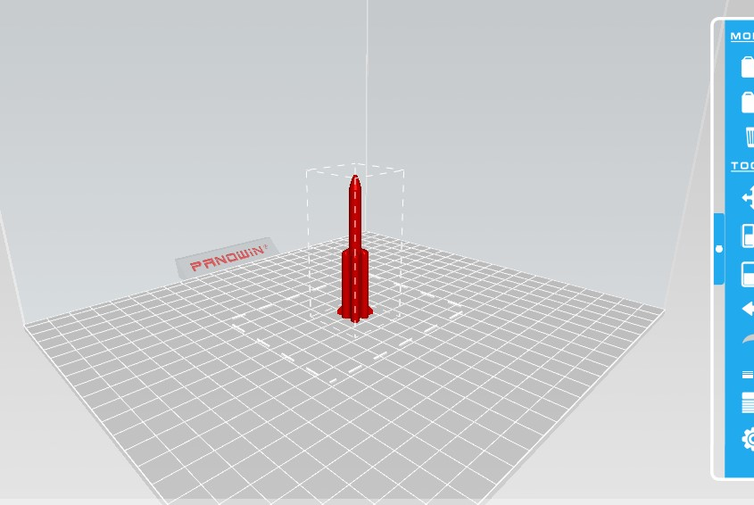
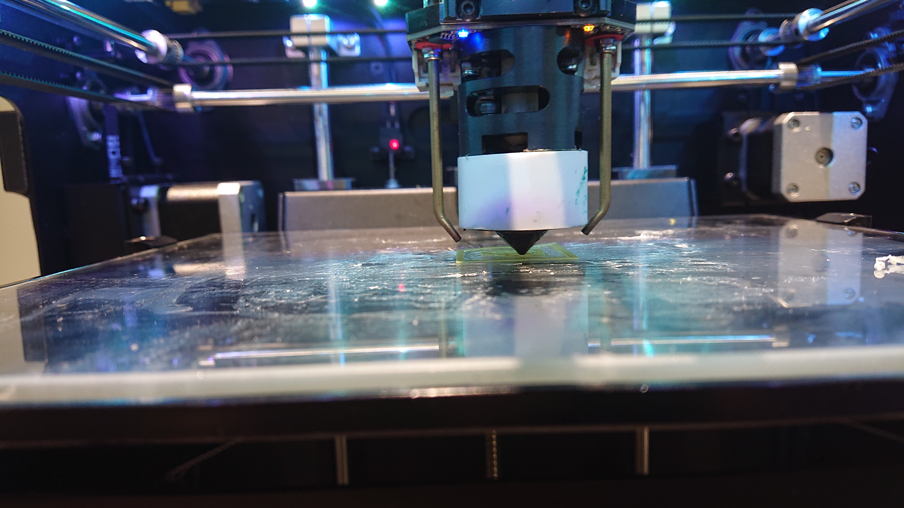
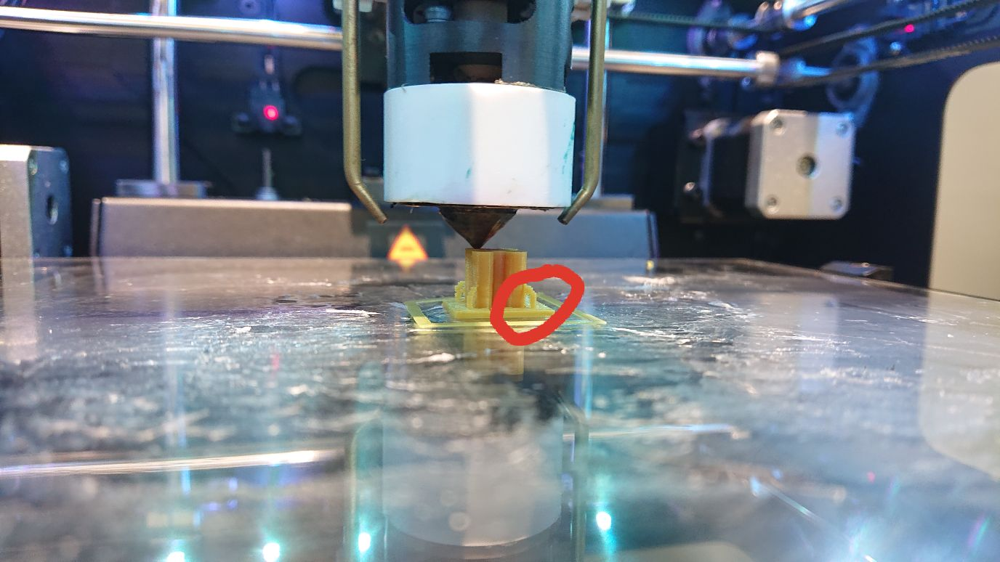
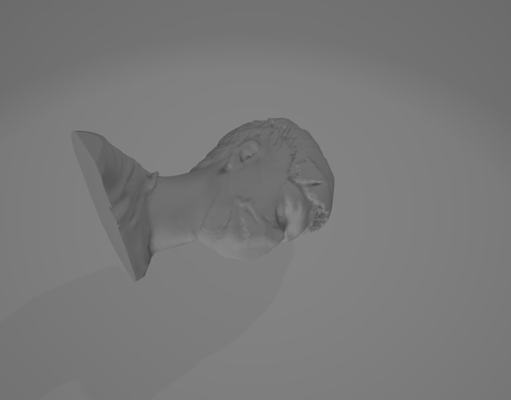

# FABOX 2020 Spring

---

## Project 1 Laser Cutting

The first class we tried to use the laser cutter, but I didn't save any record of that, so here's the repo of the laser cut part of the final project.

By www.makercase.com, I generated a box's dxf and import it into Fusion 360.

With some editing I got the box blueprint for printing.

Powering on the Laser cutter, the initialize process stuck at "Homing X+"

And I found that one connector was down and the whole laser head was not aligned.

After disassembled some of the components and plug in the connector, it behaves as normal.

Auto focusing is not accurate, so I manually adjusted Z-axis to focus on the acrylic plate.

Then I found that I made mistake when drawing. I used the length of the LCD bezzle but the width of LCD screen.

After further editing and re-printing, I got what I want.

---

## Project 2 3D Printing

In project 2, I made a model of newest series rocket CZ-5B by CASC.

The nose cone part is mde by streching the key point of natural polygon. In rendering it looks not very satisfying.

Slice it with panowin's slicing tool Pango, I got the pcode file for printing.

Start printing

However, due to the problem of accuracy, the flaps' shape is not so satisfying

And got the finished work:

---

## Project 3 Interact with Arduino

In this project, I made a clock with Arduino.

When powering on, it will first show a booting animation:

For the real time reference, it is given to user.
The user need to input the current time in serial connection in format YYYY/MM/DD HH:MM:SS

Then the Arduino will calculate current time from the given time using millis() function.

---

## Project 4 3D Scanning

In this project, I got a 3D face scan of myself.
However, the model of my shoulder was corrupted, so I cut them in the modeling software.

---

## Project 5 Build an 2-axis machine with an actuator

