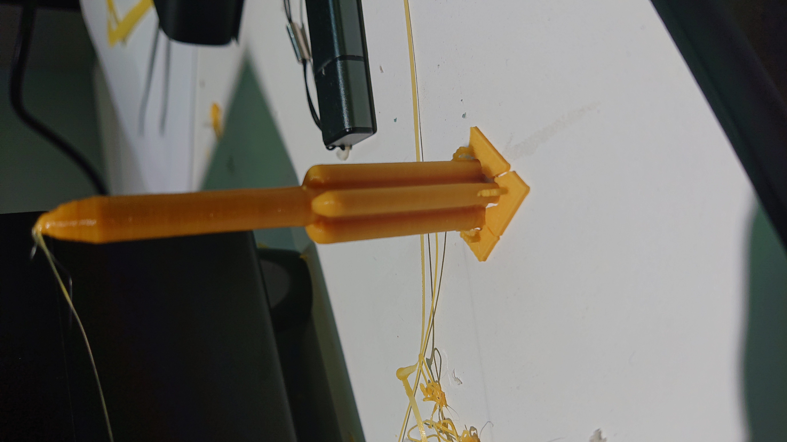
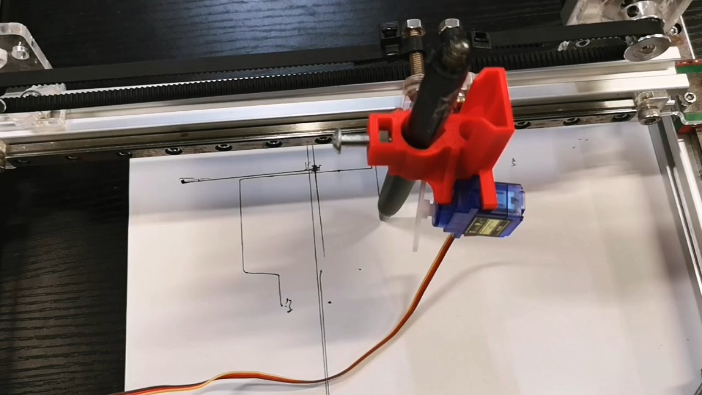
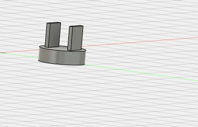
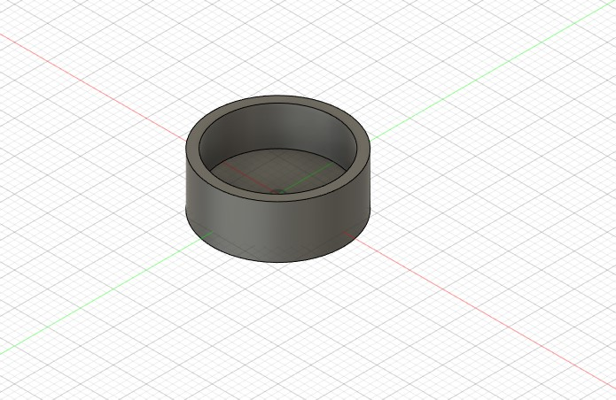
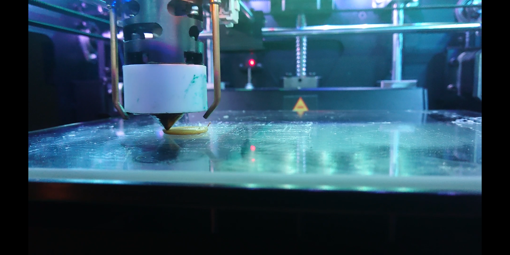
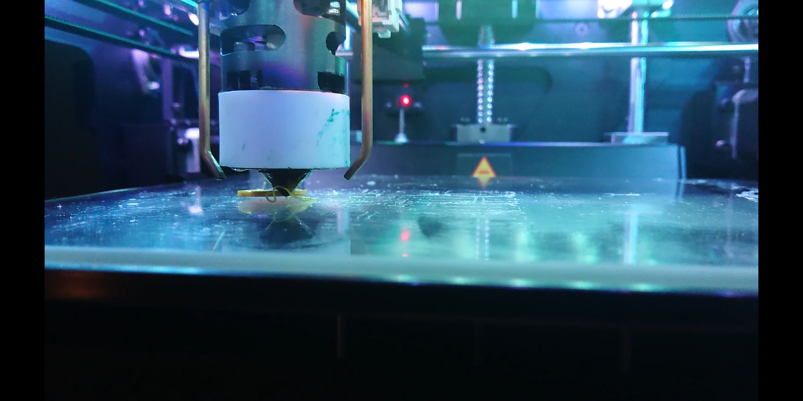
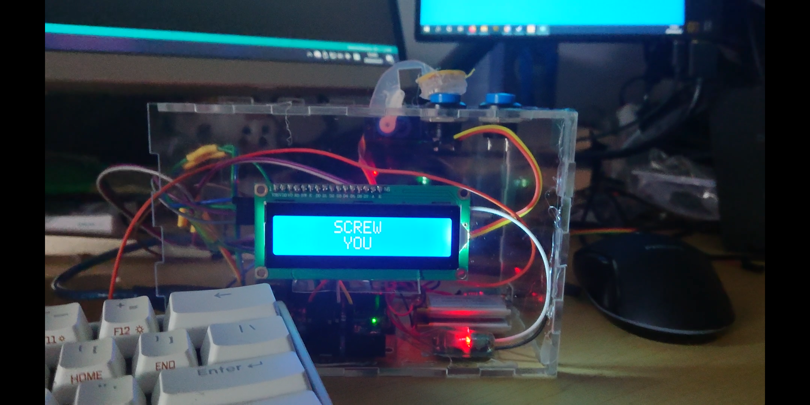

# FABOX 2020 Spring

Notice: Website not finished, this README.md is okay for reading.

---

## Project 1 Laser Cutting

The first class we tried to use the laser cutter, but I didn't save any record of that, so here's the repo of the laser cut part of the final project.

By www.makercase.com, I generated a box's dxf and import it into Fusion 360.

With some editing I got the box blueprint for printing.

Powering on the Laser cutter, the initialize process stuck at "Homing X+"

And I found that one connector was down and the whole laser head was not aligned.

After disassembled some of the components and plug in the connector, it behaves as normal.

Auto focusing is not accurate, so I manually adjusted Z-axis to focus on the acrylic plate.

Then I found that I made mistake when drawing. I used the length of the LCD bezzle but the width of LCD screen.

After further editing and re-printing, I got what I want.

---

## Project 2 3D Printing

In project 2, I made a model of newest series rocket CZ-5B by CASC.

The nose cone part is mde by streching the key point of natural polygon. In rendering it looks not very satisfying.

Slice it with panowin's slicing tool Pango, I got the pcode file for printing.

Start printing

However, due to the problem of accuracy, the flaps' shape is not so satisfying

And got the finished work:

---

## Project 3 Interact with Arduino

In this project, I made a clock with Arduino.

When powering on, it will first show a booting animation:

For the real time reference, it is given to user.
The user need to input the current time in serial connection in format YYYY/MM/DD HH:MM:SS

Then the Arduino will calculate current time from the given time using millis() function.

---

## Project 4 3D Scanning

In this project, I got a 3D face scan of myself.
However, the model of my shoulder was corrupted, so I cut them in the modeling software.

---

## Project 5 Build an 2-axis machine with an actuator

In this project, we work as group to build a 2-axis machine, with a pen attached as the actuator.

---

## Final Project

For final project, as the theme is "Who am I", I built an alarm clock that forces me to keep respect to it.
I made the clock with a RTC module, two lithium rechargeable batteries, a charge controller, a 3V to 5V converter, a buzzer for alarm, 1602 LCD screen and a servo motor.

Meanwhile, I made use of integrated BLE for alarm setting, IMU for shock detecting.

The target is that when user gentlely press the alarm button, the alarm shuts off, but if user bumps the desk to show his anger of waking him up, the alarm will detect the shock and cover the button to avoid user from stopping it.

### Circuit Part

Power supply: 2*400mAh Li-ion battery. When testing, the output of converter varies by voltage of li-ion battery from 5V-12V, hence it can only be plugged in to Vin but not 5V, and other components who needs 5V in have to connect from Arduino. So I soldered this parallel with the charge controller.

And it works.

I2C Modules: LCD1602 and TinyRTC

Since I2C devices can be chained connected and differs by its address, I paralleled the modules' SCL and SDA, for the power input, they all needs 5V input, so I made serveral wires like this:

Output System: Servo motor and buzzer

Thanks to the I2C module I bought gives a Vin pass through, I have the power supply for the servo motor and buzzer, I soldered them together:

And connect them to the port on Arduino.

### Structural Part

For the structural, most of which is introduced in the Project1 part.

I was intended to use 3D print in the project and made some componets' model like these

It starts well

But always gives me a piece of scrap, for they are too small.

So I turned to laser cutter. I draw some rings on it and cut them out, then I stick them together with hot glue. It turned out to be great.

After assembling, my target realized.

